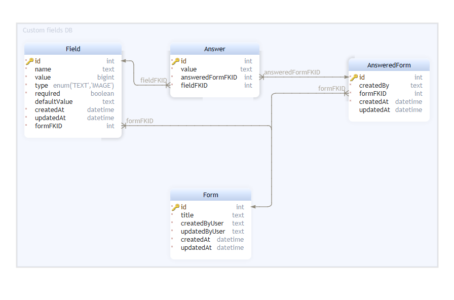
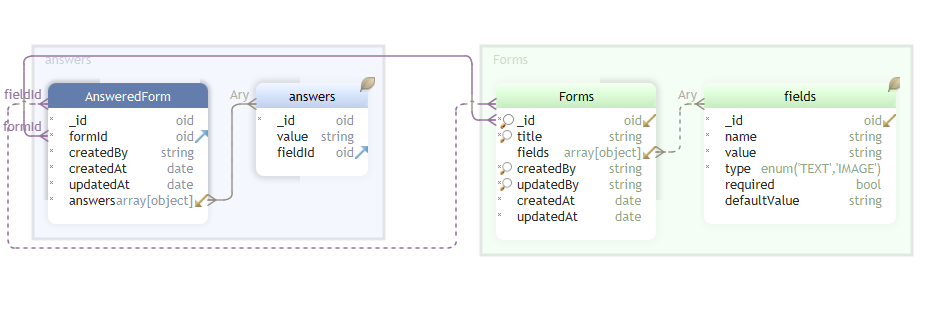
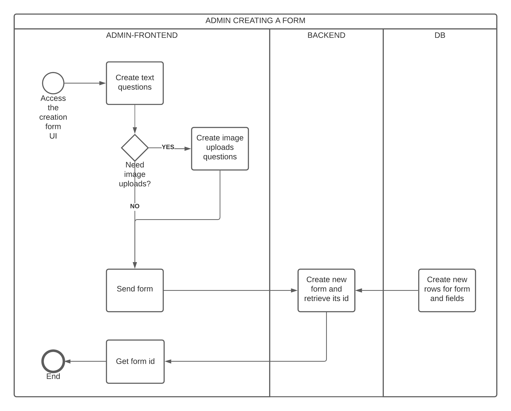
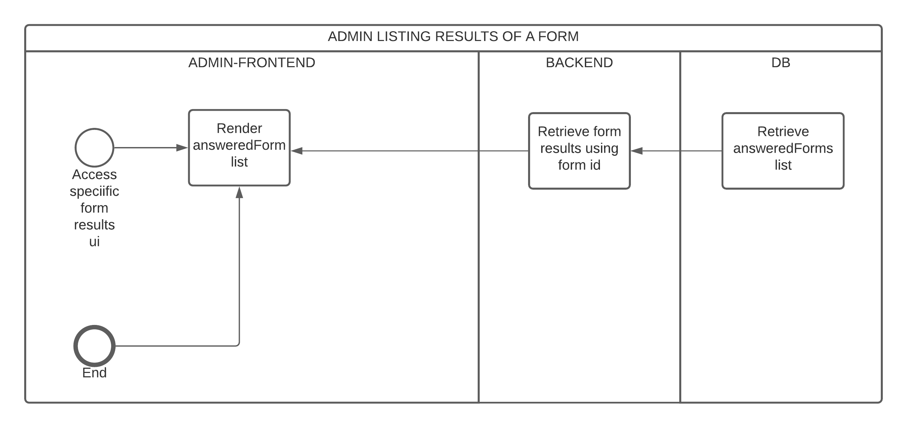
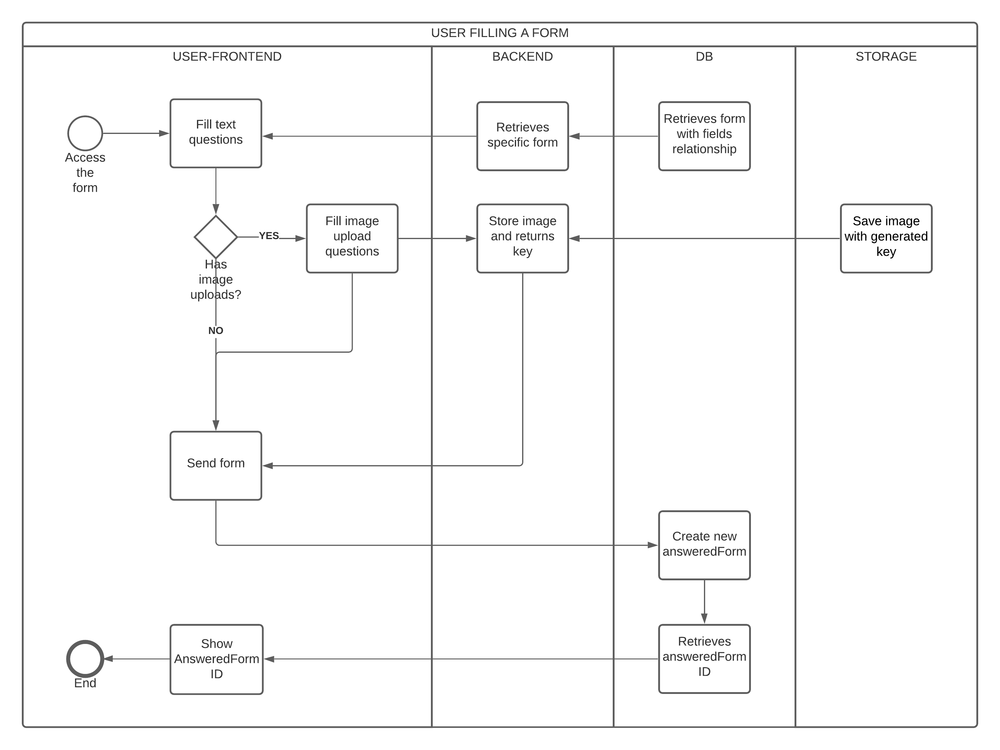
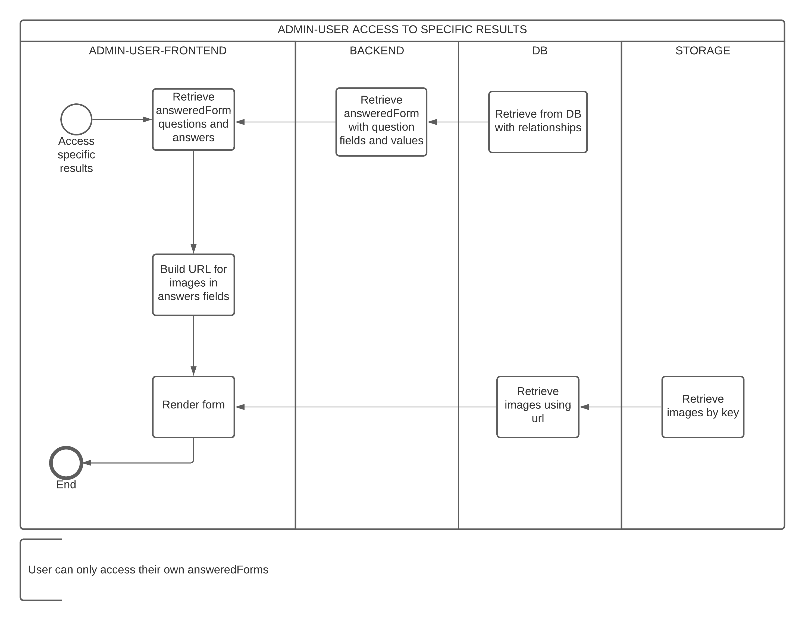
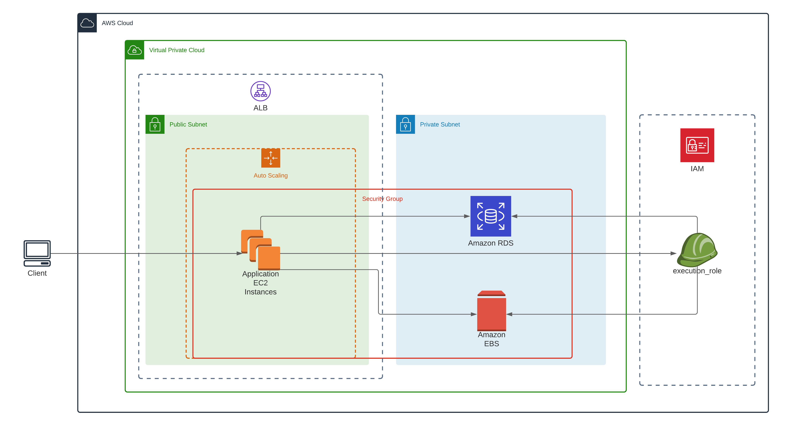
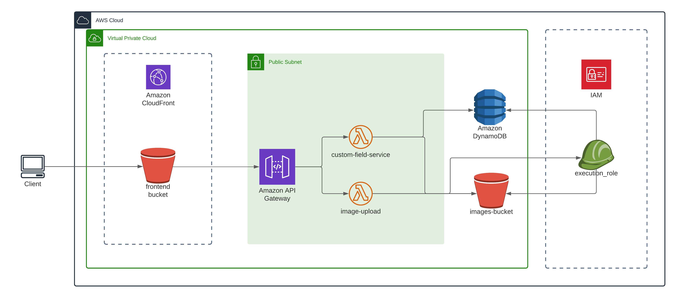

# WanderJaunt Eng Challenge

## Personal Information

- Manuel Ochoa Loaiza
- +573167449599
- mochoa1127@gmail.com

## Getting started

> Optional: Use virtualenv

Install project dependencies:

    $ pip install -r requirements.txt

Then apply the migrations:

    $ python manage.py makemigrations
    $ python manage.py migrate

Later, load the data to seed the database:

    $ python manage.py loaddata Turns.json

To run the server:

    $ python manage.py runserver

## Part 1: Org Chart

The code for this challenge is located in `employees/views.py`

**Solution**: Visit [http://127.0.0.1:8000/employees/]()

## Part 2: A slack from Ryan

The code for this challenge is located in `turns/models.py`

**Solution**: I placed two management commands in order to test this from terminal:

    $ python manage.py projected_turns --date DATE
    $ python manage.py projected_sameday_turns --date DATE

where `DATE` is a given date in `YY-MM-DD` format, i.e:

    $ python manage.py projected_turns --date 2022-02-14
    $ python manage.py projected_sameday_turns --date 2022-02-14

> **Note:** `scripts/transform_turns_seed.py` allowed me to transform the example data that was provided in to fixture
> Django format, allowing me to seed the Turn db when necessary

## Part 3: Spec: Property "Custom Fields"

### Summary

The "Activation team: Custom fields" project will solve the issues our activation team is having to track
semi-structured data for teams on the ground, this product will allow the activation team to build custom forms, using
multiple, simple and created-dynamically fields like text and images

### Scope

To achieve the implementation of this project, my team will create a new product divided in three components: frontend
application to get all the possible interactions from user and admin, backend application for processing the
incoming/outgoing data, and infrastructure as a code to hold the resources of this application, in a two months deadline

### Modeling

### Persistence options

1. **SQL**:

2. **NoSQL**:

There are only two collections here `Forms` and `AnsweredForms`. This could be achieved in MongoDB and DynamoDB as well

#### Common workflow

- Admin:
    1. Enter the application as activation team member
    2. Able CRUD any form
    3. Able to share any form link
    4. Able to see list of form answers
    5. Optional: Admin can export results
- Client:
    1. Enter the application as a form filler:
    2. Able to fill a specific form shared previously by admin
    3. Able to edit responses before sending
    4. Able to upload images

#### BMPN

The following approaches are regarding infrastructure focused in AWS. They could also be achieved at on-premises
resources as well

#### Traditional approach

**Component diagram**

| Component      | Type |   Description |
| ----------- | ----------- | ----------- |
| Virtual Private Cloud      | VPC       |  Entity holding the company resources |   
| Public subnet      | Subnet       |  Public subnet exposing internet access and holding apps |   
| Private subnet      | Subnet       |  Private subnet exposing db and storage resources only to the app |   
| Security Group      | Security Group      |  Firewall allowance |   
| ALB      | Application Load Balancer       |  Allows to distribute the load among apps |
| Auto Scaling      | Auto Scaling Group       |  Rules that allow to scale up or down vertically the number of app instances |
| Amazon RDS     |  Relational Database Service |  SQL Database |
| Amazon EBS     |  Elastic Block Storage |  Shared storage for multiple instance apps |
| execution_role     |  IAM Role |  Permissions used by the instances app to access resources in the VPC |

**Annotations:**

- Almost any of these resources could be on premises
- Instance app could be a Django app installed with a configuration script from a versioning resource
- EBS will store the images and will be shared across multiple apps if necessary
- Authentication could be an existing or implemented service
- Django app can exist already as a monolith

#### Serverless approach

**Component diagram**

| Component      | Type |   Description |
| ----------- | ----------- | ----------- |
| Virtual Private Cloud      | VPC       |  Entity holding the company resources |   
| Public subnet      | Subnet       |  Public subnet exposing internet access and holding apps |
| Amazon Cloudfront      | CDN       |  Service in charge to deliver the SPA frontend application as static files |
| frontend-bucket     |  Amazon S3 | Object storage to save the SPA frontend app |
| Amazon API Gateway     |  Amazon API Gateway | API as a Service |
| customer-field-service     |  Lambda Function | Function to CRUD the forms and answers data |
| image-upload     |  Lambda Function | Function return url to upload files to S3 |
| Amazon DynamoDB     |  Amazon DynamoDB | NoSQL database |
| image-bucket     |  Amazon S3 | Object storage to save the images |
| execution-role     |  Amazon IAM | Allow the lambdas to run and communicate to other AWS Services |

**Annotations:**

- This architecture is FaaS oriented
- customer-field-service will allow to CRUD the forms
- image-upload is a service to partially upload images to the cloud, it returns a pre-signed url to upload the image a
  return a key of the image which can be stored in the persistence layer
- Needs no scaling, because lambdas scale by themselves
- Frontend App exists as an SPA stored in a bucket and distributed by CloudFront as a cdn
- DynamoDB is NoSQL, it allows heavy query performance on not structured data. ERM is similar to the one exposed before.
  A well-designed application only will require one DynamoDB table
- API Gateway is in charge of deliver API Calls to the lambdas, no ALB needed
- Lambdas are agnostic to language

### API

| Method      | Endpoint |   Description | Expected status code | Roles |
| ----------- | ----------- | ----------- | ----------- | ----------- |
| GET      | forms       |  return all forms, can be filtered |  200  | admin,user |   
| POST      | forms       |  Create new form |  201 | admin |
| GET      | forms/:id       |  Retrieve specific form | 200 |  admin, user |
| PUT      | forms/:id       |  Update an specific form | 201 | admin |
| PATCH      | forms/:id       |  Update an specific form | 204 | admin |
| DELETE      | forms/:id       |  Delete an specific form | 200 |  admin |
| GET      | forms/:id/answers       |  Retrieve all answers for a given form | 200 | admin |
| GET      | answer/:id       |  Retrieves single answer to a form | 200 |  admin,user |
| PUT      | answer/:id       |  Updates the whole answer | 201 | admin,user |
| PATCH      | answer/:id       |  Updates the answer to a form partially | 204 | admin,user |
| DELETE      | answer/:id       |  Delete the answers of a form | 204 |  admin |
| GET      | upload       |  Retrieve signed url to upload | 200 |  admin,user |
| POST      | {GIVEN_PRESIGNED_URL}       |  Create a new image in the system and returns its key | 200 | admin,user |

    